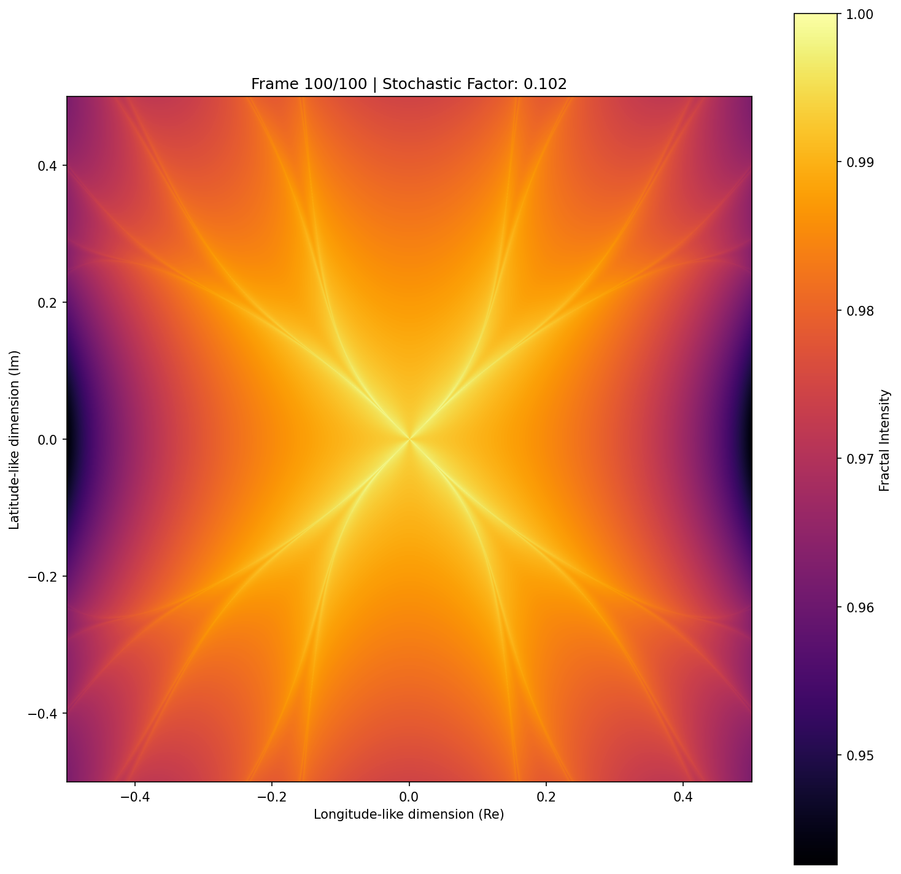

# The Stochastic Universe: Order from Chaos

**A unified framework, quantum-inspired architecture, and computational proof of Stochastic Determinism.**

<p align="center">
  
  <br/>
  <em>The Naturalist Fractal at σ ≈ 0.35 — the crystallization peak. The central X-shaped topological invariant persists across three orders of magnitude of stochastic noise.</em>
</p>

---

## The Century-Old Debate, Resolved.

For a century, modern physics has been conceptually divided. Albert Einstein famously declared that *"God does not play dice with the universe,"* defending strict determinism. Niels Bohr and the quantum pioneers accepted pure, irreducible randomness.

This repository presents the computational proof for the third answer: **God is the universal principle governing the stochastic motion of the dice, and its continuous interaction with the deterministic causes that shape reality.**

Welcome to the **Stochastic Universe**. Here, we demonstrate through hard data science, quantum simulation, and complex systems modeling that randomness is not the enemy of order. It is its primary architect.

By engineering a self-stabilizing quantum circuit — the **MetaQubit** — and observing its effects on a recursive complex plane, we have discovered the **Naturalist Fractal**: a topological invariant that morphologically simulates cosmological expansion and mathematically proves that extreme noise inevitably generates indestructible structure.

---

## Core Discoveries

### 1. The Naturalist Fractal
A newly discovered fractal geometry defined by the recursive map:

$$Z_{n+1} = Z_n^2 + c + s_n \cdot q \cdot (e^{i \cdot \arg(Z_n)} + \sin(|Z_n|^2 \cdot Z_n))$$

where $q$ is the quantum factor provided by the MetaQubit circuit at each recursion level. Across 1,000 realizations and three orders of magnitude of stochastic perturbation ($\sigma: 0.003 \to 1.002$), the central X-shaped topological core is never destroyed. It dims, it thins, but it reconstitutes. The attractor is indestructible.

### 2. The MetaQubit Architecture
A novel quantum-inspired processing unit built on [PennyLane](https://pennylane.ai/), validated across **13 independent benchmarks**:

| Property | MetaQubit | Standard Simulator | Factor |
|----------|-----------|-------------------|--------|
| Circuit depth stability | 0.992 ± 0.042 | 0.001 ± 0.229 | **992×** |
| Measurement std deviation | 0.000222 | 0.999998 | **4,500×** |
| QAOA MaxCut score | 1.437 | 0.703 | **2×** |
| Implicit error recovery | 39–74% | ~0% | — |
| Network coordination | 4,950 edges / 12 qubits | — | **412:1** |

The MetaQubit achieves **Dynamic Homeostasis**: a self-regulating balance between entropy, structured entanglement, and quantum tunneling — without any explicit stabilization code.

### 3. The Information Identity Law
Extracted via a 13-phase machine learning pipeline (ARIMA, Random Forest, Gradient Boosting, Neural Networks), the system's Energy Coherence collapses into a strict empirical identity:

$$\mathcal{V}(\text{EC}) = 99.9979\% \cdot \mathcal{V}(\overline{I}) + 0.0021\% \cdot \mathcal{V}(n_{\text{frame}})$$

The structure *is* the spatial density. Information and geometry are not analogous — they are the same thing, expressed at different scales.

---

## Repository Architecture

The project is organized into two root directories and structured as three research pillars:

```
.
├── stochastic_universe/          ← Pillar 1: The Theory
│   ├── theory/                   ← 47 chapter files (7 chapters)
│   ├── build_unified.py          ← Assembles the full manuscript
│   └── stochastic_universe_complete.md  ← The unified book (~45K words)
│
└── naturalist_fractal/           ← Pillars 2 & 3: The Engine + The Proof
    ├── meta_qubit.py             ← MetaQubit source code
    ├── naturalist_fractal_2D.py  ← 2D fractal renderer (2000×2000)
    ├── naturalist_fractal_3D.py  ← 3D surface rendering
    ├── naturalist_fractal_4D.py  ← 4D animated evolution (depth sweep)
    ├── fractal_frames/           ← 1,000 experimental frames (5 runs × 200)
    ├── 1_Fractal_Structural_Invariance/   ← Pillar 3: ML validation
    │   ├── geometric_shape_analysis.md
    │   ├── First_dynamic_patterns_analysis.md
    │   ├── energy_coherence_analysis.md      ← 13-phase ML pipeline
    │   └── frame_analysis/                   ← Analysis scripts & plots
    └── 2_MetaQubit_Dynamic_Homeostasis/     ← Pillar 2: Quantum engine
        ├── 1_Quantum_Benchmarking/          ← 13 benchmark experiments
        ├── 2_Network_Self_Organization/     ← 100-node network coordination
        └── 3_Internal_Dynamics/            ← Noise, tunneling, heatmaps
```

---

### Pillar 1 — The Theory

The foundational framework spanning physics, biology, social sciences, and philosophy across 7 chapters:

| Chapter | Title |
|---------|-------|
| 1 | From Chaos to Order |
| 2 | Stochastic Determinism in Physical Systems |
| 3 | Emergence of Order in Biological Systems |
| 4 | Randomness and Structure in Socio-Economic Systems |
| 5 | Stochastic Paradoxical Logic |
| 6 | The Unified Stochastic Framework |
| 7 | The Naturalist Fractal — The Computational Proof |

**[Read the full manuscript →](stochastic_universe/stochastic_universe_complete.md)**
**[Browse individual chapters →](stochastic_universe/theory/)**

---

### Pillar 2 — The Quantum Engine (MetaQubit)

The source code and full benchmark documentation of the MetaQubit architecture.

**[Full 13-experiment benchmark analysis →](naturalist_fractal/2_MetaQubit_Dynamic_Homeostasis/1_Quantum_Benchmarking/BENCHMARK_ANALYSIS.md)**
**[Network self-organization (100 nodes, 4,950 edges) →](naturalist_fractal/2_MetaQubit_Dynamic_Homeostasis/2_Network_Self_Organization/NETWORK_ANALYSIS.md)**
**[Internal dynamics: noise, tunneling, heatmaps →](naturalist_fractal/2_MetaQubit_Dynamic_Homeostasis/3_Internal_Dynamics/INTERNAL_DYNAMICS_ANALYSIS.md)**
**[MetaQubit overview →](naturalist_fractal/2_MetaQubit_Dynamic_Homeostasis/README.md)**

---

### Pillar 3 — The Proof (Data Science Validation)

The empirical core: 1,000 fractal realizations analyzed by 12 independent algorithms across three methodological pipelines.

**[Geometric shape analysis →](naturalist_fractal/1_Fractal_Structural_Invariance/geometric_shape_analysis.md)**
**[Dynamic patterns & attractor states →](naturalist_fractal/1_Fractal_Structural_Invariance/First_dynamic_patterns_analysis.md)**
**[Energy coherence & the Information Identity →](naturalist_fractal/1_Fractal_Structural_Invariance/energy_coherence_analysis.md)**

---

## Getting Started

**Dependencies:**

```bash
pip install numpy matplotlib pennylane scikit-learn scipy opencv-python networkx
```

**Generate the 2D Naturalist Fractal** (2000×2000, localized view):

```bash
python naturalist_fractal/naturalist_fractal_2D.py
```

**Run the 3D Cosmological Isomorphism** (surface rendering):

```bash
python naturalist_fractal/naturalist_fractal_3D.py
```

**Animate the 4D Fractal Evolution** (depth sweep, interactive):

```bash
python naturalist_fractal/naturalist_fractal_4D.py
```

**Run the MetaQubit internal dynamics analyses** (from repo root):

```bash
PYTHONPATH=naturalist_fractal python naturalist_fractal/2_MetaQubit_Dynamic_Homeostasis/3_Internal_Dynamics/HeatmapAnalysis.py
PYTHONPATH=naturalist_fractal python naturalist_fractal/2_MetaQubit_Dynamic_Homeostasis/3_Internal_Dynamics/NoiseAnalysis.py
```

**Assemble the full theoretical manuscript:**

```bash
python stochastic_universe/build_unified.py
```

---

## Academic Publications & DOIs

This research has been modularly published to ensure academic rigor and targeted citation. The theoretical framework and computational discoveries are officially registered on Zenodo.

*If you use the MetaQubit architecture, the Naturalist Fractal equations, or the Stochastic Paradoxical Logic (SPL) in your research, please cite the respective DOIs:*

- 🔗 **[From Chaos to Order: A Stochastic Approach to Self Organizing Systems](https://doi.org/10.20944/preprints202502.1719.v1)**
- 🔗 **[Stochastic Determinism in Physical Systems: A Unified Perspective on Quantum and Classical Stability](https://doi.org/10.20944/preprints202503.1177.v1)**
- 🔗 **[Emergence of Order in Biological Systems: A Stochastic Perspective](https://doi.org/10.20944/preprints202505.2246.v1)**
- 🔗 **[Randomness and Structure in Socio-Economic Systems](https://doi.org/10.20944/preprints202505.2286.v1)**
- 🔗 **[Stochastic Paradoxical Logic: A New Framework for Understanding Reality Through Paradox and Probability](https://doi.org/10.20944/preprints202505.2126.v1)**
- 🔗 **[Foundations for a Unified Stochastic Framework: Bridging Physics, Biology, and Socio-Economic Systems](https://doi.org/10.20944/preprints202506.0023.v1)**

*The following papers are currently under submission to Zenodo. DOIs will be assigned upon publication:*

- ⏳ **The MetaQubit: A Self-Stabilizing, Quantum-Inspired Architecture for Noise-Resilient Computation** *(DOI pending)*
- ⏳ **The Naturalist Fractal: A Computational Proof of Stochastic Determinism and Structural Invariance in Complex Systems** *(DOI pending)*

---

> *"The journey that began with a question — why does order exist? — ends not with a philosophical argument but with a computational fact: order exists because stochastic systems cannot help but generate it."*
>
> **— Nikos Demopoulos**
